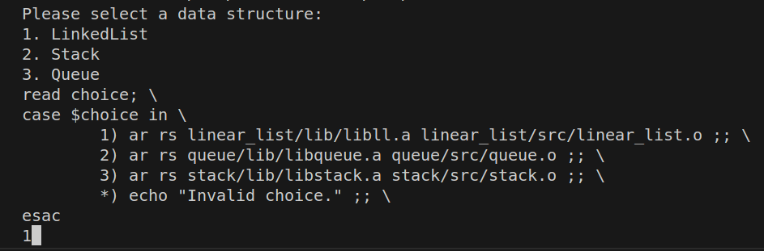

# Standard Project Blueprint in C programming
### _The Fundamental Project Structure, System Build and Basic Coding_

This project contains a collection of basic C programs. The programs are designed to teach the fundamentals of C programming, such as variables, data types, operators, control flow statements, functions, static and dynamic libraries, Makefile, Data Structures, and more.

## Features

- Build a list with LINEAR or QUEUE, STACK formats
- Operations allowed in LINEAR list (linear_list.c, linear_list.h)

      -Add node

      -Print node data

      -Delete node

      -Reverse list
- Operations allowed in QUEUE list (queue_list.c, queue_list.h)

      -Push node

      -Pop node

      -Print node data
- Operations allowed in QUEUE list (queue_list.c, queue_list.h)

      -Push node

      -Pop node

      -Print node data
- Compile time option (Macro) defined to compile the list either QUEUE or STACK or LINEAR
- Wrapper functions (custom memory allocation)
- All .c and .h files uses static/dynamic library (list.a/list.so) adn perform operation
- Callback (function pointer) to notify empty list
- Print memory statistics

## Installation and Usage

> For Linux System
1. Clone the repository
```
git clone https://github.com/TheAyushB/basics-of-c-programming.git
```
2. In terminal
```
make
```
`make` - is a build automation tool that is used to compile and build the project's source code into an executable or library.


```
./deb
```
`./deb` - Execute the selected part of the program.

: the output is displayed in the console
3. To clean or remove any generated files or artifacts created during the build process
```
make clean
```

> For Windows

 Following changes are required in the current program:
 
1. Replace all occurrences of `deb` in the `Makefile` to `exe`.
2. Instead of `make` use `MinGW32-make`.
3. Instead of `./deb` use `./exe`.
4. For removing generated build files use `MinGW32-make clean`.